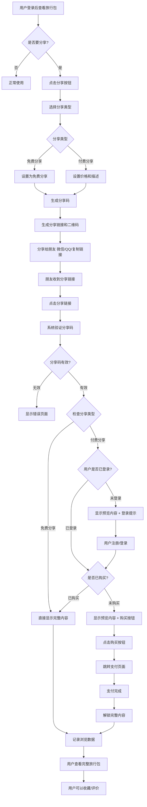
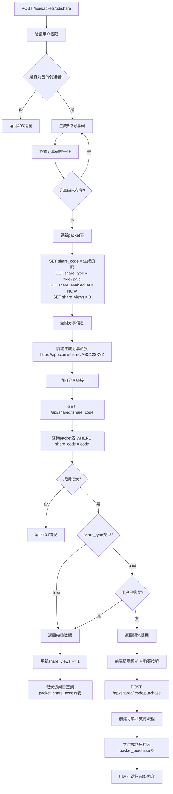

# 旅行包分享功能设计方案

## 概述
实现用户分享旅行包的功能，支持免费分享和付费分享两种模式，让用户可以将自己的旅行经验变现。

## 用户体验流程

### 用户分享流程图


## 技术实现流程

### API 调用流程图


## 数据库设计

### 1. 扩展现有 packet 表
```sql
-- 为 packet 表添加分享相关字段
ALTER TABLE packet ADD COLUMN share_code TEXT UNIQUE;
ALTER TABLE packet ADD COLUMN share_type TEXT DEFAULT 'private'; -- 'private', 'free', 'paid'
ALTER TABLE packet ADD COLUMN share_price NUMERIC(10,2); -- 付费价格
ALTER TABLE packet ADD COLUMN share_enabled_at TIMESTAMP;
ALTER TABLE packet ADD COLUMN share_views INTEGER DEFAULT 0;
ALTER TABLE packet ADD COLUMN share_purchases INTEGER DEFAULT 0;
```

### 2. 新增分享访问记录表
```sql
CREATE TABLE packet_share_access (
  id SERIAL PRIMARY KEY,
  packet_id INTEGER REFERENCES packet(id),
  share_code TEXT NOT NULL,
  visitor_ip INET,
  visitor_user_id TEXT, -- 如果用户已登录
  access_type TEXT, -- 'view', 'purchase'
  user_agent TEXT,
  accessed_at TIMESTAMP DEFAULT NOW()
);
```

## API 设计

### 1. 分享管理接口

#### 开启分享
```http
POST /api/packets/:id/share
Authorization: Bearer <token>
Content-Type: application/json

{
  "shareType": "free", // "free" | "paid"
  "price": 29.99, // 仅当 shareType 为 "paid" 时需要
  "description": "精心规划的成都2日游行程"
}
```

**响应：**
```json
{
  "success": true,
  "data": {
    "shareCode": "K7X9M2P5",
    "shareUrl": "https://yourapp.com/shared/K7X9M2P5",
    "qrCodeUrl": "https://api.qrserver.com/v1/create-qr-code/?data=...",
    "shareType": "paid",
    "price": 29.99
  },
  "message": "分享已开启"
}
```

#### 更新分享设置
```http
PUT /api/packets/:id/share
Authorization: Bearer <token>
Content-Type: application/json

{
  "shareType": "paid",
  "price": 39.99,
  "description": "更新后的描述"
}
```

#### 关闭分享
```http
DELETE /api/packets/:id/share
Authorization: Bearer <token>
```

#### 获取分享统计
```http
GET /api/packets/:id/share/stats
Authorization: Bearer <token>
```

**响应：**
```json
{
  "success": true,
  "data": {
    "views": 156,
    "purchases": 12,
    "revenue": 359.88,
    "conversionRate": 7.69,
    "recentAccess": [
      {
        "accessedAt": "2024-01-15T10:30:00Z",
        "accessType": "view",
        "userLocation": "北京"
      }
    ]
  }
}
```

### 2. 分享访问接口

#### 访问分享内容
```http
GET /api/shared/:shareCode
```

**免费分享响应：**
```json
{
  "success": true,
  "data": {
    "packet": {
      "id": 7,
      "name": "成都眉山2日游",
      "description": "探索成都的美食和文化",
      "shareType": "free",
      "author": {
        "name": "李小明",
        "avatar": "https://...",
        "experience": "资深旅行达人"
      },
      "itineraryDays": [...], // 完整行程数据
      "markers": [...] // 完整地点数据
    }
  }
}
```

**付费分享预览响应：**
```json
{
  "success": true,
  "data": {
    "packet": {
      "id": 7,
      "name": "成都眉山2日游",
      "description": "探索成都的美食和文化",
      "shareType": "paid",
      "price": 29.99,
      "currency": "CNY",
      "author": {
        "name": "李小明",
        "avatar": "https://...",
        "experience": "资深旅行达人",
        "rating": 4.8,
        "reviews": 156
      },
      "preview": {
        "totalDays": 2,
        "highlightPlaces": ["春熙路", "宽窄巷子"],
        "sampleDay": {
          "name": "第1天",
          "description": "市区经典景点游览",
          "markers": [
            {
              "title": "春熙路",
              "type": "shopping",
              "description": "成都最繁华的商业街" // 部分信息
            }
          ]
        }
      },
      "isPurchased": false,
      "purchaseRequired": true
    }
  }
}
```

#### 购买付费内容
```http
POST /api/shared/:shareCode/purchase
Authorization: Bearer <token>
Content-Type: application/json

{
  "paymentMethod": "alipay" // "alipay", "wechat", "card"
}
```

## 前端页面设计

### 1. 分享设置页面 (`/packets/:id/share`)
- 分享开关
- 分享类型选择 (免费/付费)
- 价格设置 (付费模式)
- 分享描述编辑
- 预览效果
- 分享链接和二维码生成
- 分享统计数据

### 2. 分享内容页面 (`/shared/:shareCode`)
- 响应式设计，支持移动端
- 作者信息展示
- 免费内容：完整展示
- 付费内容：预览模式 + 购买入口
- 社交分享按钮
- 收藏/点赞功能

### 3. 分享管理面板 (`/dashboard/shares`)
- 所有分享内容列表
- 每个分享的统计数据
- 快速开启/关闭分享
- 收入统计图表

## 安全考虑

### 1. 防滥用机制
- IP限流：同一IP 24小时内访问次数限制
- 分享码复杂度：8位字母数字组合，避免猜测
- 访问日志：记录所有访问行为用于分析

### 2. 内容保护
- 付费内容关键信息脱敏
- 图片水印添加
- 防爬虫机制

### 3. 支付安全
- 集成可靠的支付平台 (支付宝/微信支付)
- 订单状态验证
- 退款处理机制

## 实施计划

### 第一阶段：基础功能 (Week 1-2)
- [ ] 数据库表结构扩展
- [ ] 分享码生成和验证逻辑
- [ ] 基础分享API开发
- [ ] 免费分享功能实现

### 第二阶段：付费功能 (Week 3-4)
- [ ] 付费分享预览模式
- [ ] 支付接口集成
- [ ] 购买流程实现
- [ ] 订单管理系统

### 第三阶段：用户体验优化 (Week 5-6)
- [ ] 分享页面优化
- [ ] 二维码生成
- [ ] 分享统计面板
- [ ] 移动端适配

### 第四阶段：高级功能 (Week 7-8)
- [ ] 社交分享集成
- [ ] 内容推荐系统
- [ ] 评价和反馈系统
- [ ] 数据分析报表

## 技术要点

### 1. 分享码生成算法
```typescript
function generateShareCode(): string {
  const chars = '23456789ABCDEFGHJKLMNPQRSTUVWXYZ'; // 排除易混淆字符
  let result = '';
  for (let i = 0; i < 8; i++) {
    result += chars.charAt(Math.floor(Math.random() * chars.length));
  }
  return result;
}
```

### 2. 预览内容策略
- 显示前2天完整行程
- 其余天数仅显示标题
- 地点信息部分脱敏（模糊坐标）
- 重要提示和攻略隐藏

### 3. 缓存策略
- 分享内容缓存 24小时
- 访问统计数据实时更新
- 二维码图片CDN缓存

## 成功指标

### 用户指标
- 分享功能使用率 > 30%
- 付费转化率 > 5%
- 用户满意度 > 4.5/5

### 业务指标
- 月度分享收入增长
- 平台交易佣金增长
- 优质内容创作者增长

---

**注意事项：**
1. 所有数据库修改都是增量操作，不删除现有字段
2. 目前只使用 development 分支进行开发
3. 确保向后兼容性，现有功能不受影响
4. 遵循项目现有的代码规范和架构模式